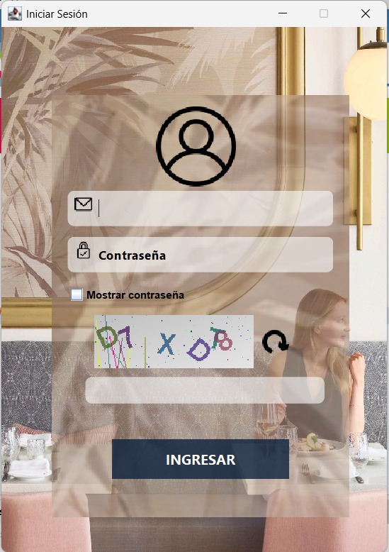
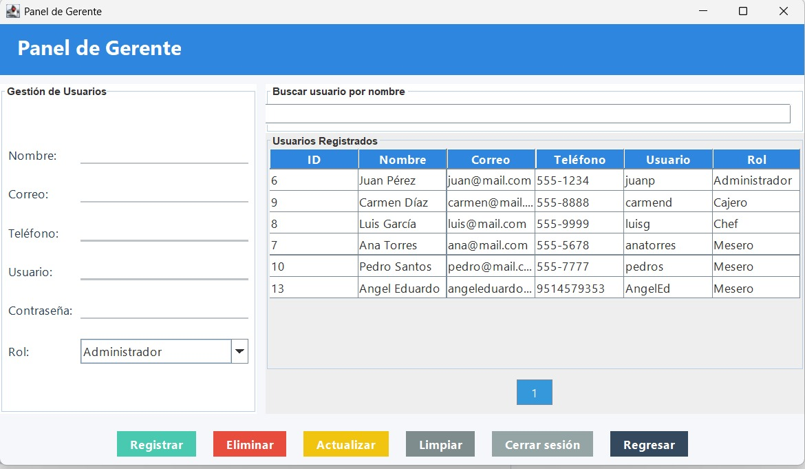
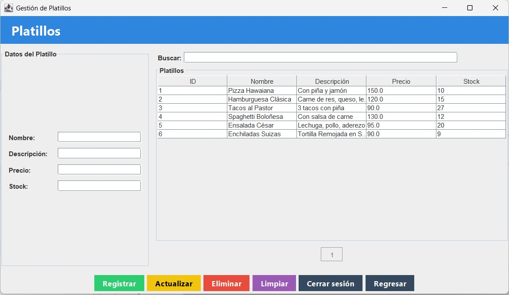
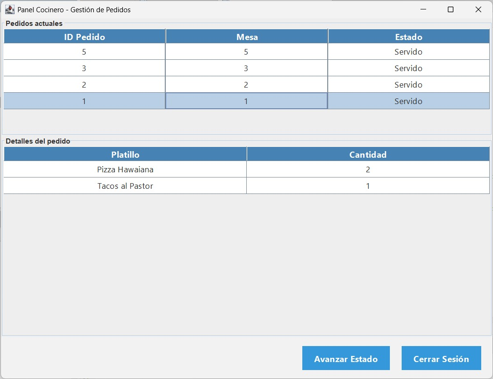
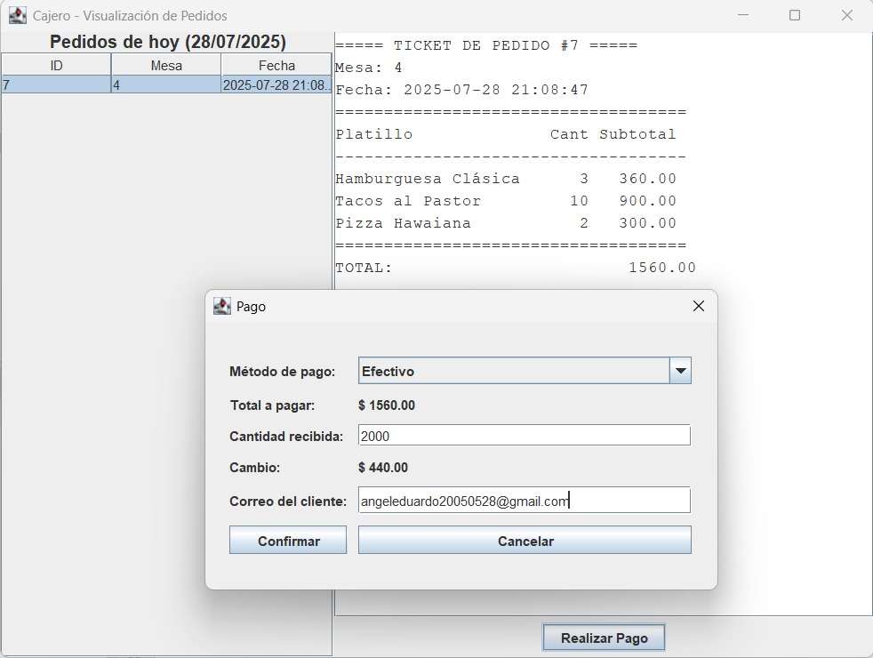
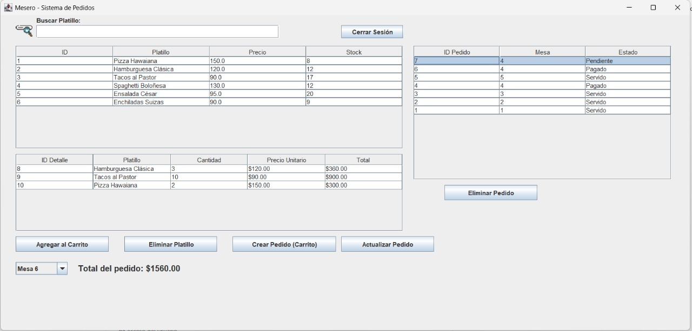
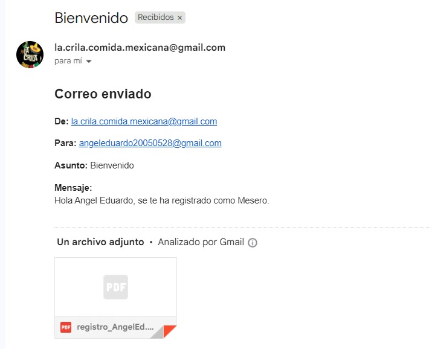
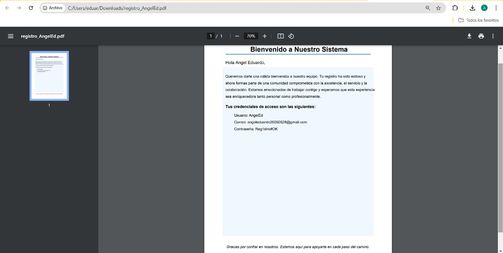
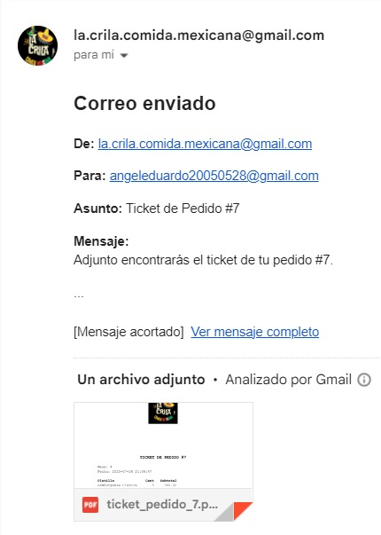
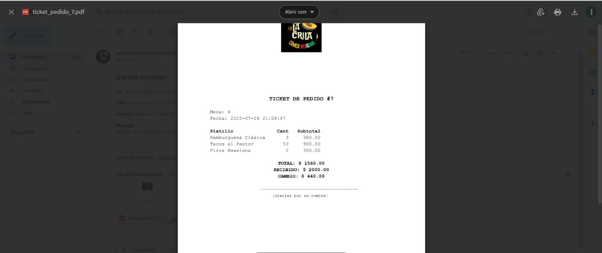

# 🍽️ SISTEMA DE GESTIÓN DE UN RESTAURANTE - Restaurante “La Crila”
---
**Número de equipo:**  
Equipo 12
---
## 👥 Colaboradores

- Cristian Martínez Pacheco – [@CristianMartinezz1](https://github.com/CristianMartinezz1)
- Ángel Eduardo Velasco Vásquez – [@Angel-Eduardo-Velasco-Vasquez](https://github.com/Angel-Eduardo-Velasco-Vasquez)

---
## ¿Que hace el Sistema?

Este proyecto implementa un sistema de escritorio para la gestión operativa y administrativa del restaurante **“La Crila”**, permitiendo una administración eficiente del personal, las mesas, los platillos y los pedidos diarios.

---

## 🎯 Objetivo

Desarrollar una aplicación de escritorio que permita gestionar las operaciones internas de un restaurante, integrando funciones como:

- Administración del personal
- Control de mesas disponibles
- Gestión del menú de platillos
- Registro y seguimiento de pedidos

---

## 🖥️ Tipo de Sistema

**Desktop App en Java**, utilizando la biblioteca gráfica **Swing**.

---

## 📚 Librería Externa Implementada

Se integra la libreria“CorreoElectronico” del equipo 2 para envió de correos electrónicos - https://github.com/olmomomo/Libreria_correoElectronico. 

Ademas de la libreria "ENvio de Correos con Archivos Adjuntos" del equipo 2 - https://github.com/olmomomo/Libreria_correoElectronico.

---

## Componente Visual Implementado 

Usamos el componente visual “CAPTCHA” del equipo 2 - https://github.com/FanyBr07/ComponenteVisual.

---

## Integracion de CAPTCHA

Al iniciar sesión se implemento el CAPTCHA y se debe de introducir correctamente para ingresar al panel correspondiente, cuenta con una opcion de refrescar en dado caso que no se llegue a apreciar del todo bien.

---

## CRUD de Usuarios

Existen cuatro niveles de usuario en nuestro programa: Gerente, Mesero, Cocinero (chef) y cajero. El Gerente es el único que se encarga de Agregar, Eliminar, Visualizar y Actualizar los datos de los demás usuarios.

---

## CRUD de Productos

De igual forma el Gerente se encarga de Agregar, Eliminar, Visualizar y Actualizar los datos de los platillos que se manejan en el restaurante.

---

## Proceso Principal 

Administración de personal en un restaurante

- Gerente - Se encarga de registrar nuevos usuarios/platillos, y estos mismos, eliminarlos, visualizarlos y actualizarlos

       

- Cocineros – Se encarga de actualizar el estado de los pedidos creados

- Cajeros - Se encargan de generar los tickets de los pedidos y recibir los pagos de los clientes.

- Mesero - Se encarga de actualizar los pedidos realizados en el sistema 

---

## Envio de Correo Electronico con PDF adjunto

Se implementó un módulo en Java llamado GeneradorPDF que crea un archivo PDF personalizado al registrar un nuevo usuario en el sistema del restaurante “La Crila”. Este PDF contiene un mensaje de bienvenida y las credenciales de acceso del usuario.

Para su desarrollo se utilizó la librería Apache PDFBox, que permite generar documentos PDF de forma programada. El archivo incluye:

- Un título y fondo decorativo.

- Un saludo personalizado.

- Un texto informativo dividido automáticamente en líneas.

- Los datos de usuario (correo, usuario y contraseña).

- Un mensaje final de agradecimiento

Finalmente, el PDF se guarda en el equipo local, listo para ser enviado por correo o utilizado como comprobante.

   

---

## Envio de Ticket al realizar el Pago

Al igual que en el envío de PDF al momento de agregar un nuevo usuario al sistema, de igual forma al momento de realizar un pago de algún platillo se le proporciona el ticket a la persona, mediante su correo electrónico, todo esto con el fin de que el usuario tenga un respaldo de lo que consumió en el restaurante. 

      

   

---

Nombre de librerías externas utilizadas 

- CaptchaCadenas.jar – Equipo 2
- CorreoElectronico.jar – Equipo 2
- activation-1.1.1.jar
- commons-logging.1.3.5.jar
- fontbox-2.0.34.jar
- Javax.mail(1).jar
- Javax.mail-api-1.6.2.jar
- mysql-connector-j-9.3.0.jar
- pdfbpx-2.0.34.jar
- proyectoTopicos.jar

---

Pasos para instalar/ejecutar el proyecto 

1._Desgargar el Archivo .ZIP desde el apartado “<> CODE”

2._Extraer el archivo

3._ Crear en MySQL la base de datos sistema_usuarios (PDF BASE DE DATOS sistema_usuarios)

4._Abrir NetBeans

5._Abrir el proyecto anteriormente descargado

6._Ejecutar “FormularioInicioSesion”

---

Requisitos mínimos 

- Netbeans Instalado
- Java jdk 24
- MySQL 8.4

